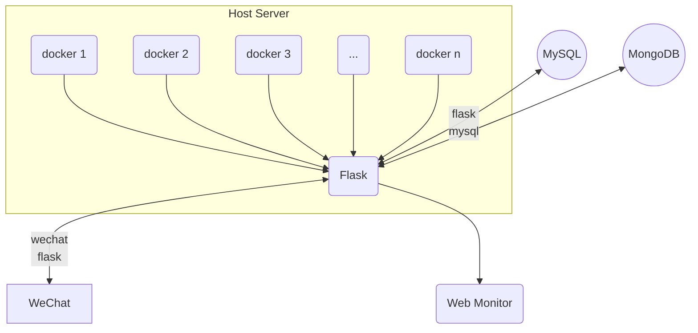

# The Task We Need Do



# 描述

这是我们目前所需要完成的理想结构，本项目目前最大的问题是，呃，前期生成的数据有一点小问题，我们前期设计的数据是这样的：

```python

        # 组装最终输出记录（共 13 个字段）
        return {
            "device_id": self.profile.dog_id,          # 设备（狗）唯一标识
            "timestamp": self.sim_time.isoformat(),    # 模拟时间戳 (ISO 8601)
            "behavior": self._behavior,                # 当前行为状态
            "heart_rate": vital["heart_rate"],          # 心率 (bpm)
            "resp_rate": vital["resp_rate"],            # 呼吸频率 (次/分钟)
            "temperature": vital["temperature"],        # 体温 (°C)
            "steps": self._today_steps,                # 今日累计步数
            "battery": 100,                            # 电量（当前阶段不模拟，固定 100）
            "gps_lat": round(self._gps_lat, 6),        # GPS 纬度
            "gps_lng": round(self._gps_lng, 6),        # GPS 经度
            "event": event_name,                       # 当前活跃事件名称（无事件时为 None）
            "event_phase": event_phase,                # 事件阶段（onset/peak/recovery，无事件时为 None）
        }


```

我们在一开始，我们的计算，应该在云服务器端完成，比如，当心率异常，呼吸频率异常的时候我们必须要从云服务器端，通过一个api接口，返回一个值，比如一个warning，来警告

flask里面，必须要有相关的api接口，这样我们的WeChat小程序，才能看到是否正常。

另外一点就是，我们的每一个docker里面，只负责生成数据；绑定 device 的能力应该放在 flask 端，由服务端维护用户与设备的关联关系。

绑定关系建立后，Engine 仍然只上报设备遥测数据，不再在每条 json 里追加 **user_id**。

接下来就是

对于我们的网页端，我们后期要实现的相关功能是，可视化的检测狗（当然这是后话了

## 任务一

我们已经完成了前期 Engine 生成 `user_id` 的修正。当前需要做的是把这件事在说明文档里统一说清楚：Engine record 不含 `user_id`，Flask / MySQL / 微信绑定 / TUI 本地会话各自承担自己的身份语义，主链路和加密校验都必须保持可跑通。

请你阅读本项目，核对这条边界是否在各份说明文件里都已经一致，并补齐遗漏、修正错误。
